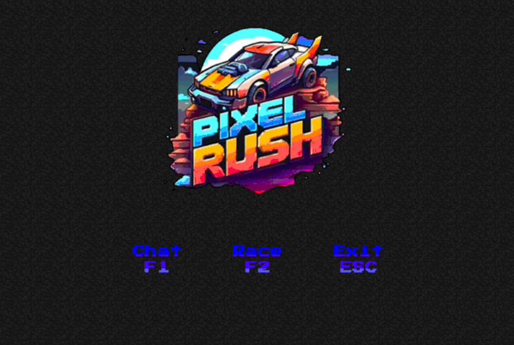
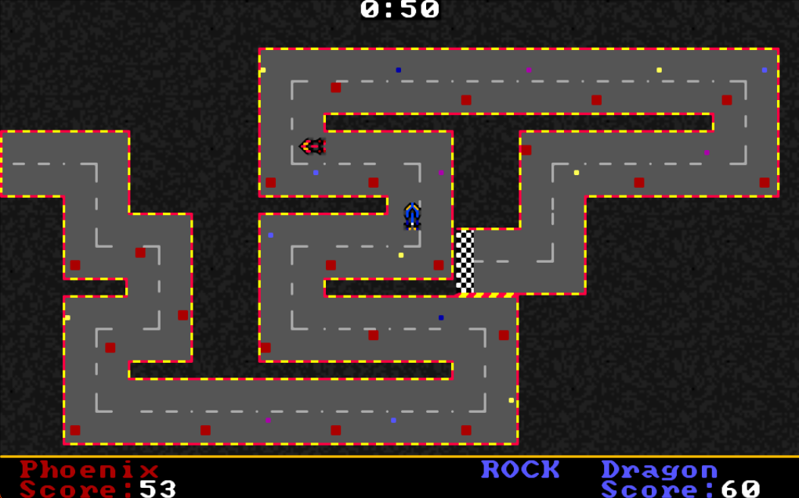
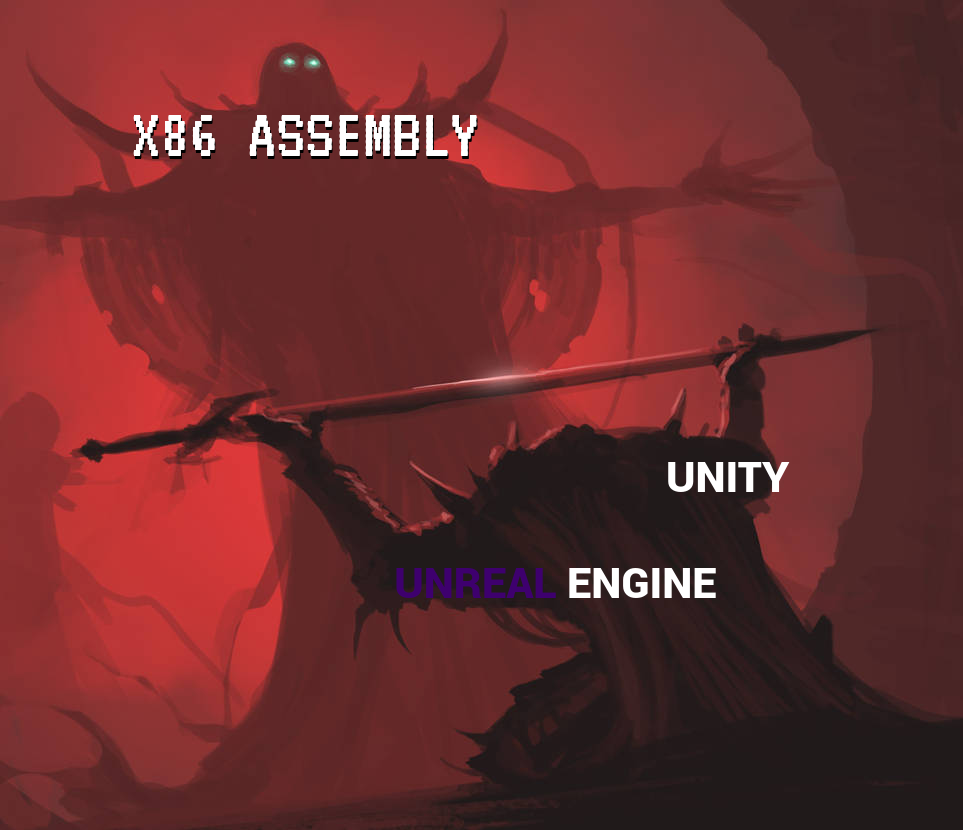

# <p style="text-align:center;">🔥 **Pixel Rush: Rush to your Destiny** 🔥</p>

Welcome to **Pixel Rush**, the ultimate two-player racing game that brings pixel art to life! Get ready to dive into the fast-paced world of racing where every race is a new adventure!

<div align="center">
    
</div>

## 🏁 **About the Game**

Pixel Rush is a thrilling two-player racing game built entirely with x86 assembly. With custom pixel art and dynamic race tracks, each race offers a fresh and exciting experience.

### 🎮 **Gameplay Features**

- **Dynamic Tracks**: Every race features a newly generated track, ensuring no two races are ever the same!
- **Exciting Power-ups**:
  - **<p style="color:cyan; display:inline;">Turbo </p>**: Boost your speed and leave your opponent in the dust!
  - **<p style="color:purple; display:inline;">Slow Opponent </p>**: Temporarily slow down your rival to gain the upper hand.
  - **<p style="color:red; display:inline;">Spawn Obstacle </p>**: Place obstacles in your opponent’s path to throw them off.
  - **<p style="color:yellow; display:inline;">Phase Through Obstacle </p>**: Pass through obstacles effortlessly with this special power-up.
- **Multiplayer Mode**: Play on the same computer or connect with friends on different computers and in that case you will have a built-in chat mode for seamless communication.

## 🎨 **Stunning Pixel Art**

Every element of Pixel Rush is crafted with beautiful custom pixel art, creating a visually stunning and immersive experience. Get ready to be amazed by the vibrant and detailed graphics!

<div align="center">
    
</div>

## 🛠️ **Technical Details**

- **Built with x86 Assembly**: Experience the power and precision of assembly language in this high-performance racing game.
- **Seamless Multiplayer**: Enjoy smooth multiplayer gameplay whether you're on the same machine or connecting remotely.

<div align="center">
    
</div>

## 📥 **Download and Set Up**

1. Clone the repository:
    ```bash
    git clone https://github.com/The-White-Hats/Pixel-Rush.git
    ```
2. Open the repository in VS Code

3. Download both VSCode and MASM/TASM extensions


## 🚀 **Get Started**

1. Open any .asm file

1. Right click and choose 'Open Emulator' option

2. Navigate to the run.bat file(s)

**<span style="color:red;">Note</span>** : to play on the same computer - which is the recommended - switch to the **Phase-1** branch

## 🙌 **Contributors**

<table align='center'>
<tr>
    <td align="center" style="word-wrap: break-word; width: 150.0; height: 150.0">
        <a href=https://github.com/Ahmed-Aladdiin>
            
            <br />
            <sub style="font-size:14px"><b>Ahmed Aladdin</b></sub>
        </a>
    </td>
    <td align="center" style="word-wrap: break-word; width: 150.0; height: 150.0">
        <a href=https://github.com/marwan2232004>
            
            <br />
            <sub style="font-size:14px"><b>Marwan Alhameedy</b></sub>
        </a>
    </td>
    <td align="center" style="word-wrap: break-word; width: 150.0; height: 150.0">
        <a href=https://github.com/AhmedHamed3699>
            
            <br />
            <sub style="font-size:14px"><b>Ahmed Hamed</b></sub>
        </a>
    </td>
    <td align="center" style="word-wrap: break-word; width: 150.0; height: 150.0">
        <a href=https://github.com/Adham-hussin>
            
            <br />
            <sub style="font-size:14px"><b>Adham Hussin</b></sub>
        </a>
    </td>
</tr>
</table>
